# ER Diagram

Auto-generated by `lsdb erdiagram` on 2026-08-06T07:49:19.177Z. Re-run after schema changes to refresh.

## Tables by actor

- **admin**: actions, catalog_items, categories, cities, commission_charges, credentials, cuisines, districts, featured_restaurants, floors, invoices, merchant_applications, merchant_invites, module_actions, modules, notification_templates, platform_settings, reservation_forwards, reservation_tokens, restaurant_booking_policies, restaurant_cuisines, restaurant_hours, restaurant_hours_exceptions, restaurant_locations, restaurant_reports, restaurant_staff, restaurant_status_history, restaurants, reviews, role_permissions, roles, rooms, schema_versions, services, subscriptions, support_ticket_messages, support_tickets, tables, users
- **user**: profile, reservations

## Diagram

```mermaid
erDiagram
    actions {
        string action_id PK
        string key UK
        string name
        string name_zh
        string name_km
        string name_ko
        number sort_order
        date _created_at
        date _updated_at
        string _id UK
    }
    catalog_items {
        string item_id PK
        string restaurant_id FK
        string item_type
        string name
        string name_zh
        string name_km
        string name_ko
        string description
        string description_zh
        string description_km
        string description_ko
        number price_from
        string icon
        string color
        string image
        string category_id FK
        boolean active
        number sort_order
        number quantity
        number daily_capacity
        date _created_at
        date _updated_at
        string _id UK
    }
    categories {
        string category_id PK
        string name UK
        string name_zh
        string name_km
        string name_ko
        string icon
        boolean active
        number sort_order
        string moderation_status
        string submitted_by
        date _created_at
        date _updated_at
        string _id UK
    }
    cities {
        string city_id PK
        string name UK
        string name_zh
        string name_km
        string name_ko
        boolean active
        number sort_order
        date _created_at
        date _updated_at
        string _id UK
    }
    commission_charges {
        string charge_id PK
        string restaurant_id FK
        string reservation_id UK
        string user_id FK
        number amount
        number rate
        string status
        string invoice_id FK
        date _created_at
        date _updated_at
        string _id UK
    }
    credentials {
        string user_id PK
        string password_hash
        date _created_at
        date _updated_at
        string _id UK
    }
    cuisines {
        string cuisine_id PK
        string name UK
        string name_zh
        string name_km
        string name_ko
        string icon
        boolean active
        number sort_order
        string moderation_status
        string submitted_by
        date _created_at
        date _updated_at
        string _id UK
    }
    districts {
        string district_id PK
        string city_id FK
        string name
        string name_zh
        string name_km
        string name_ko
        boolean active
        number sort_order
        date _created_at
        date _updated_at
        string _id UK
    }
    featured_restaurants {
        string feature_id PK
        string restaurant_id FK
        string placement
        date starts_at
        date ends_at
        number sort_order
        boolean active
        date _created_at
        date _updated_at
        string _id UK
    }
    floors {
        string floor_id PK
        string restaurant_id FK
        string location_id FK
        string name
        string name_zh
        string name_km
        string name_ko
        number sort_order
        boolean active
        date _created_at
        date _updated_at
        string _id UK
    }
    invoices {
        string invoice_id PK
        string restaurant_id FK
        string subscription_id FK
        number amount
        string currency
        string status
        date due_date
        date paid_at
        string description
        date _created_at
        date _updated_at
        string _id UK
    }
    merchant_applications {
        string application_id PK
        string restaurant_name
        string applicant_name
        string contact_email
        string contact_phone
        string description
        string document_url
        string status
        string rejection_reason
        date _created_at
        date _updated_at
        string _id UK
    }
    merchant_invites {
        string invite_id PK
        string restaurant_id FK
        string email
        string token_hash UK
        string expires_at
        string used_at
        string revoked_at
        date _created_at
        date _updated_at
        string _id UK
    }
    module_actions {
        string module_action_id PK
        string module_id FK
        string action_id FK
        date _created_at
        date _updated_at
        string _id UK
    }
    modules {
        string module_id PK
        string scope
        string key UK
        string name
        string name_zh
        string name_km
        string name_ko
        string route
        string icon
        number sort_order
        boolean active
        date _created_at
        date _updated_at
        string _id UK
    }
    notification_templates {
        string template_id PK
        string key
        string channel
        string subject
        string body
        boolean active
        date _created_at
        date _updated_at
        string _id UK
    }
    platform_settings {
        string setting_key PK
        string value
        string description
        date _created_at
        date _updated_at
        string _id UK
    }
    reservation_forwards {
        string forward_id PK
        string reservation_id
        string user_id FK
        string restaurant_id FK
        string target_name
        string target_contact
        string channel
        string message
        string sent_by FK
        date sent_at
        date sla_due_at
        date responded_at
        string response_status
        date _created_at
        date _updated_at
        string _id UK
    }
    reservation_tokens {
        string token_hash PK
        string reservation_id
        string user_id FK
        date expires_at
        date _created_at
        date _updated_at
        string _id UK
    }
    restaurant_booking_policies {
        string policy_id PK
        string restaurant_id FK
        string location_id FK
        boolean deposit_required
        number deposit_amount
        number cancellation_window_hours
        number min_party_size
        number max_party_size
        number booking_window_days
        date _created_at
        date _updated_at
        string _id UK
    }
    restaurant_cuisines {
        string restaurant_cuisine_id PK
        string restaurant_id FK
        string cuisine_id FK
        date _created_at
        date _updated_at
        string _id UK
    }
    restaurant_hours {
        string hours_id PK
        string restaurant_id FK
        string location_id FK
        string day_of_week
        boolean closed
        boolean open_24h
        json periods
        date _created_at
        date _updated_at
        string _id UK
    }
    restaurant_hours_exceptions {
        string exception_id PK
        string restaurant_id FK
        string location_id FK
        date date
        string reason
        boolean closed
        json periods
        date _created_at
        date _updated_at
        string _id UK
    }
    restaurant_locations {
        string location_id PK
        string restaurant_id FK
        string name
        string name_zh
        string name_km
        string name_ko
        string contact_email
        string contact_phone
        string address
        string city_id FK
        string district_id FK
        number latitude
        number longitude
        boolean active
        number rating
        number rating_count
        number price_level
        string price_symbol
        json images
        string google_place_id UK
        date _created_at
        date _updated_at
        string _id UK
    }
    restaurant_reports {
        string report_id PK
        string restaurant_id FK
        string reporter_user_id FK
        string reason
        string details
        string status
        string reviewed_by FK
        date reviewed_at
        date _created_at
        date _updated_at
        string _id UK
    }
    restaurant_staff {
        string staff_id PK
        string restaurant_id FK
        string user_id FK
        string role_id FK
        boolean active
        date _created_at
        date _updated_at
        string _id UK
    }
    restaurant_status_history {
        string history_id PK
        string restaurant_id FK
        string from_status
        string to_status
        string reason
        string changed_by FK
        date changed_at
        date _created_at
        date _updated_at
        string _id UK
    }
    restaurants {
        string restaurant_id PK
        string application_id FK
        string owner_user_id
        string category_id FK
        string name
        string name_zh
        string name_km
        string name_ko
        string description
        string description_zh
        string description_km
        string description_ko
        string logo
        string banner
        string status
        string suspension_reason
        date _created_at
        date _updated_at
        string _id UK
    }
    reviews {
        string review_id PK
        string restaurant_id FK
        string reservation_id UK
        string reviewer_user_id FK
        string reviewer_name
        number rating
        string comment
        string merchant_reply
        date merchant_replied_at
        date _created_at
        date _updated_at
        string _id UK
    }
    role_permissions {
        string role_permission_id PK
        string role_id FK
        string module_action_id FK
        date _created_at
        date _updated_at
        string _id UK
    }
    roles {
        string role_id PK
        string scope
        string restaurant_id FK
        string name
        boolean is_system
        boolean active
        date _created_at
        date _updated_at
        string _id UK
    }
    rooms {
        string room_id PK
        string restaurant_id FK
        string location_id FK
        string floor_id FK
        string name
        string name_zh
        string name_km
        string name_ko
        number sort_order
        boolean active
        date _created_at
        date _updated_at
        string _id UK
    }
    schema_versions {
        string schema_version_id PK
        string actor_sheet_id
        string table_name
        string schema_hash
        string synced_at
        number column_count
        string _id UK
    }
    services {
        string service_id PK
        string name
        string name_zh
        string name_km
        string name_ko
        string description
        string description_zh
        string description_km
        string description_ko
        number price_from
        string icon
        string color
        string category_id FK
        boolean active
        number sort_order
        date _created_at
        date _updated_at
        string _id UK
    }
    subscriptions {
        string subscription_id PK
        string restaurant_id FK
        string tier
        string status
        date trial_ends_at
        date current_period_start
        date current_period_end
        number commission_rate
        date _created_at
        date _updated_at
        string _id UK
    }
    support_ticket_messages {
        string message_id PK
        string ticket_id FK
        string sender_user_id FK
        string body
        date _created_at
        date _updated_at
        string _id UK
    }
    support_tickets {
        string ticket_id PK
        string requester_user_id FK
        string requester_role
        string restaurant_id FK
        string reservation_id
        string subject
        string category
        string status
        string priority
        string assigned_to FK
        date _created_at
        date _updated_at
        string _id UK
    }
    tables {
        string table_id PK
        string restaurant_id FK
        string location_id FK
        string room_id FK
        string label
        number seats
        string shape
        number position_x
        number position_y
        number sort_order
        boolean active
        date _created_at
        date _updated_at
        string _id UK
    }
    users {
        string user_id PK
        string email UK
        string full_name
        string picture
        string role
        string auth_provider
        string actor_sheet_id
        string status
        string role_id FK
        date _created_at
        date _updated_at
        string _id UK
    }
    profile {
        string user_id PK
        string full_name
        string email UK
        string phone
        string avatar_url
        string bio
        date _created_at
        date _updated_at
        string _id UK
    }
    reservations {
        string reservation_id PK
        string guest_name
        number party_size
        string service_id
        string service_name
        date start_date
        date end_date
        number daily_rate
        string reservation_time
        string notes
        string status
        string restaurant_id
        string table_id
        date _created_at
        date _updated_at
        date _deleted_at
        string _id UK
    }

    restaurants ||--o{ catalog_items : "restaurant_id"
    categories ||--o{ catalog_items : "category_id"
    restaurants ||--o{ commission_charges : "restaurant_id"
    users ||--o{ commission_charges : "user_id"
    invoices ||--o{ commission_charges : "invoice_id"
    users ||--|| credentials : "user_id"
    cities ||--o{ districts : "city_id"
    restaurants ||--o{ featured_restaurants : "restaurant_id"
    restaurants ||--o{ floors : "restaurant_id"
    restaurant_locations ||--o{ floors : "location_id"
    restaurants ||--o{ invoices : "restaurant_id"
    subscriptions ||--o{ invoices : "subscription_id"
    restaurants ||--o{ merchant_invites : "restaurant_id"
    modules ||--o{ module_actions : "module_id"
    actions ||--o{ module_actions : "action_id"
    users ||--o{ reservation_forwards : "user_id"
    restaurants ||--o{ reservation_forwards : "restaurant_id"
    users ||--o{ reservation_forwards : "sent_by"
    users ||--o{ reservation_tokens : "user_id"
    restaurants ||--o{ restaurant_booking_policies : "restaurant_id"
    restaurant_locations ||--|| restaurant_booking_policies : "location_id"
    restaurants ||--o{ restaurant_cuisines : "restaurant_id"
    cuisines ||--o{ restaurant_cuisines : "cuisine_id"
    restaurants ||--o{ restaurant_hours : "restaurant_id"
    restaurant_locations ||--o{ restaurant_hours : "location_id"
    restaurants ||--o{ restaurant_hours_exceptions : "restaurant_id"
    restaurant_locations ||--o{ restaurant_hours_exceptions : "location_id"
    restaurants ||--o{ restaurant_locations : "restaurant_id"
    cities ||--o{ restaurant_locations : "city_id"
    districts ||--o{ restaurant_locations : "district_id"
    restaurants ||--o{ restaurant_reports : "restaurant_id"
    users ||--o{ restaurant_reports : "reporter_user_id"
    users ||--o{ restaurant_reports : "reviewed_by"
    restaurants ||--o{ restaurant_staff : "restaurant_id"
    users ||--|| restaurant_staff : "user_id"
    roles ||--o{ restaurant_staff : "role_id"
    restaurants ||--o{ restaurant_status_history : "restaurant_id"
    users ||--o{ restaurant_status_history : "changed_by"
    merchant_applications ||--o{ restaurants : "application_id"
    categories ||--o{ restaurants : "category_id"
    restaurants ||--o{ reviews : "restaurant_id"
    users ||--o{ reviews : "reviewer_user_id"
    roles ||--o{ role_permissions : "role_id"
    module_actions ||--o{ role_permissions : "module_action_id"
    restaurants ||--o{ roles : "restaurant_id"
    restaurants ||--o{ rooms : "restaurant_id"
    restaurant_locations ||--o{ rooms : "location_id"
    floors ||--o{ rooms : "floor_id"
    categories ||--o{ services : "category_id"
    restaurants ||--|| subscriptions : "restaurant_id"
    support_tickets ||--o{ support_ticket_messages : "ticket_id"
    users ||--o{ support_ticket_messages : "sender_user_id"
    users ||--o{ support_tickets : "requester_user_id"
    restaurants ||--o{ support_tickets : "restaurant_id"
    users ||--o{ support_tickets : "assigned_to"
    restaurants ||--o{ tables : "restaurant_id"
    restaurant_locations ||--o{ tables : "location_id"
    rooms ||--o{ tables : "room_id"
    roles ||--o{ users : "role_id"
```

