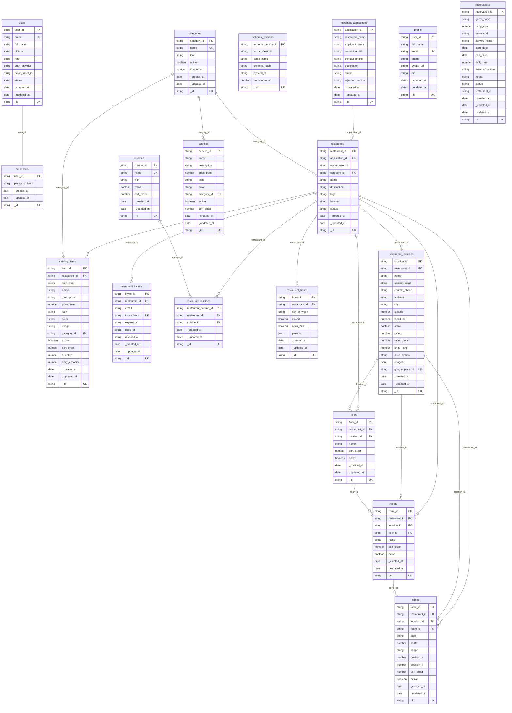

# ER Diagram

Auto-generated by `lsdb erdiagram` on 2026-08-05T08:24:03.493Z. Re-run after schema changes to refresh.

## Tables by actor

- **admin**: catalog_items, categories, credentials, cuisines, floors, merchant_applications, merchant_invites, restaurant_cuisines, restaurant_hours, restaurant_locations, restaurants, rooms, schema_versions, services, tables, users
- **user**: profile, reservations

## Diagram

